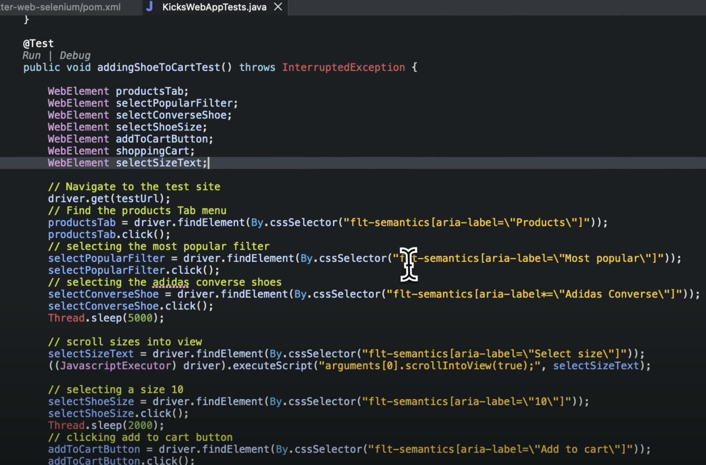

# counter_app

A new Flutter project.

## Getting Started

This project is a starting point for a Flutter application.

##### A few resources to get you started if this is your first Flutter project:

- [Lab: Write your first Flutter app](https://docs.flutter.dev/get-started/codelab)
- [Cookbook: Useful Flutter samples](https://docs.flutter.dev/cookbook)

For help getting started with Flutter development, view the
[online documentation](https://docs.flutter.dev/), which offers tutorials,
samples, guidance on mobile development, and a full API reference.

##### Check whether the 4444 port is running :

* `lsof -i :4444`
* If the command could see 2 thread, that means it's listening

##### Run the widget test with UI in MacOS chrome :

`flutter test test/widget-test.dart -d chrome`

##### Run the integration test with UI in MacOS chrome :

`flutter drive   --driver=test_driver/integration_test.dart   --target=integration_test/app_test.dart   -d chrome`

##### Run the integration test with UI in MacOS chrome :

`flutter drive   --driver=test_driver/integration_test.dart   --target=integration_test/app_test.dart   -d web-server`

The command could run successfully , but seems test case not excuted on edge browser since only the test/widget_test.dart is executed :

### Test Locally :

`flutter run -d chrome --web-renderer html`

A new chrome browser will launch with your flutter web app running with this command.

### Other Usful Commands :

* Install spec : `dart pub global activate spec_cli`  . Then we could use like **"spec --coverage --watch**"
* Install golden_toolkit : `flutter pub add golden_toolkit `. Then we could get screenshot by golden file like "**flutter test --update-goldens**", we can't add test case path in this command. Then one goldens folder in the "features" folder is generated since my test case which use golden test created in the "features" folder.
* Generate test file and step file automatically : `flutter packages pub run build_runner watch --delete-conflicting-outputs`             or              **flutter pub run build_runner watch --delete-conflicting-outputs**
* Run all golden tests "flutter test --name=GOLDEN".

### Open SemanticsBinding for flutter project :

```

void main() {
  // required to support SemanticsBinding
  WidgetsFlutterBinding.ensureInitialized();
  // add this line to render webeleent
  SemanticsBinding.instance.ensureSemantics();
  runApp(const MyApp());
  // SemanticsBinding.instance.ensureSemantics();
}
```

Automate flutter project with Selenium :



vickyzhu@MPTLSCXD3JF6XJQ counter_app % `flutter test -d edge -v`
[   +3 ms] executing: sw_vers -productName
[  +10 ms] Exit code 0 from: sw_vers -productName
[        ] macOS
[        ] executing: sw_vers -productVersion
[   +8 ms] Exit code 0 from: sw_vers -productVersion
[        ] 14.3.1
[        ] executing: sw_vers -buildVersion
[   +8 ms] Exit code 0 from: sw_vers -buildVersion
[        ] 23D60
[        ] executing: uname -m
[   +3 ms] Exit code 0 from: uname -m
[        ] arm64
[   +5 ms] executing: sysctl hw.optional.arm64
[   +3 ms] Exit code 0 from: sysctl hw.optional.arm64
[        ] hw.optional.arm64: 1
[  +40 ms] Found 1 files which will be executed as Widget Tests.
[   +3 ms] Artifact Instance of 'AndroidGenSnapshotArtifacts' is not required, skipping update.
[        ] Artifact Instance of 'AndroidInternalBuildArtifacts' is not required, skipping update.
[        ] Artifact Instance of 'IOSEngineArtifacts' is not required, skipping update.
[        ] Artifact Instance of 'FlutterWebSdk' is not required, skipping update.
[        ] Artifact Instance of 'LegacyCanvasKitRemover' is not required, skipping update.
[        ] Artifact Instance of 'WindowsEngineArtifacts' is not required, skipping update.
[        ] Artifact Instance of 'MacOSEngineArtifacts' is not required, skipping update.
[        ] Artifact Instance of 'LinuxEngineArtifacts' is not required, skipping update.
[        ] Artifact Instance of 'LinuxFuchsiaSDKArtifacts' is not required, skipping update.
[        ] Artifact Instance of 'MacOSFuchsiaSDKArtifacts' is not required, skipping update.
[        ] Artifact Instance of 'FlutterRunnerSDKArtifacts' is not required, skipping update.
[        ] Artifact Instance of 'FlutterRunnerDebugSymbols' is not required, skipping update.
[  +17 ms] Artifact Instance of 'MaterialFonts' is not required, skipping update.
[        ] Artifact Instance of 'GradleWrapper' is not required, skipping update.
[        ] Artifact Instance of 'AndroidGenSnapshotArtifacts' is not required, skipping update.
[        ] Artifact Instance of 'AndroidInternalBuildArtifacts' is not required, skipping update.
[        ] Artifact Instance of 'IOSEngineArtifacts' is not required, skipping update.
[        ] Artifact Instance of 'FlutterWebSdk' is not required, skipping update.
[        ] Artifact Instance of 'LegacyCanvasKitRemover' is not required, skipping update.
[        ] Artifact Instance of 'FlutterSdk' is not required, skipping update.
[        ] Artifact Instance of 'WindowsEngineArtifacts' is not required, skipping update.
[        ] Artifact Instance of 'MacOSEngineArtifacts' is not required, skipping update.
[        ] Artifact Instance of 'LinuxEngineArtifacts' is not required, skipping update.
[        ] Artifact Instance of 'LinuxFuchsiaSDKArtifacts' is not required, skipping update.
[        ] Artifact Instance of 'MacOSFuchsiaSDKArtifacts' is not required, skipping update.
[        ] Artifact Instance of 'FlutterRunnerSDKArtifacts' is not required, skipping update.
[        ] Artifact Instance of 'FlutterRunnerDebugSymbols' is not required, skipping update.
[        ] Artifact Instance of 'IosUsbArtifacts' is not required, skipping update.
[        ] Artifact Instance of 'IosUsbArtifacts' is not required, skipping update.
[        ] Artifact Instance of 'IosUsbArtifacts' is not required, skipping update.
[        ] Artifact Instance of 'IosUsbArtifacts' is not required, skipping update.
[        ] Artifact Instance of 'IosUsbArtifacts' is not required, skipping update.
[        ] Artifact Instance of 'FontSubsetArtifacts' is not required, skipping update.
[        ] Artifact Instance of 'PubDependencies' is not required, skipping update.
[  +39 ms] Skipping pub get: version match.
[  +65 ms] Found plugin integration_test at /Users/vickyzhu/flutter/packages/integration_test/
[  +34 ms] Found plugin integration_test at /Users/vickyzhu/flutter/packages/integration_test/
[  +28 ms] Found plugin integration_test at /Users/vickyzhu/flutter/packages/integration_test/
[   +1 ms] Generating /Users/vickyzhu/FlutterProjects/counter_app/android/app/src/main/java/io/flutter/plugins/GeneratedPluginRegistrant.java
[  +16 ms] executing: sysctl hw.optional.arm64
[   +3 ms] Exit code 0 from: sysctl hw.optional.arm64
[        ] hw.optional.arm64: 1
[        ] executing: /usr/bin/arch -arm64e xcrun xcodebuild -version
[  +71 ms] Exit code 0 from: /usr/bin/arch -arm64e xcrun xcodebuild -version
[        ] Xcode 15.3
           Build version 15E204a
[  +93 ms] running test package with arguments: [--chain-stack-traces, --, file:///Users/vickyzhu/FlutterProjects/counter_app/test/widget_test.dart]
00:00 +0: loading /Users/vickyzhu/FlutterProjects/counter_app/test/widget_test.dart                                                                                      [  +95 ms] test 0: starting test /Users/vickyzhu/FlutterProjects/counter_app/test/widget_test.dart
[   +2 ms] Stopping scan for flutter_test_config.dart; found project root at /Users/vickyzhu/FlutterProjects/counter_app
[   +1 ms] Compiler will use the following file as its incremental dill file:
/var/folders/fz/74bt1cjn5mlc7wvqj4gsx86r0000gn/T/flutter_tools.D37tNF/flutter_test_compiler.edEaSb/output.dill
[        ] Listening to compiler controller...
[   +5 ms] Compiling file:///var/folders/fz/74bt1cjn5mlc7wvqj4gsx86r0000gn/T/flutter_tools.D37tNF/flutter_test_listener.EU6Iqa/listener.dart
[  +24 ms] Found plugin integration_test at /Users/vickyzhu/flutter/packages/integration_test/
[   +8 ms] No packages with native assets. Skipping native assets compilation.
[        ] Writing native_assets.yaml.
[   +6 ms] Writing /Users/vickyzhu/FlutterProjects/counter_app/build/native_assets/macos/native_assets.yaml done.
[   +1 ms] /Users/vickyzhu/flutter/bin/cache/dart-sdk/bin/dartaotruntime --disable-dart-dev
/Users/vickyzhu/flutter/bin/cache/dart-sdk/bin/snapshots/frontend_server_aot.dart.snapshot --sdk-root
/Users/vickyzhu/flutter/bin/cache/artifacts/engine/common/flutter_patched_sdk/ --incremental --no-print-incremental-dependencies --target=flutter
--experimental-emit-debug-metadata --output-dill /var/folders/fz/74bt1cjn5mlc7wvqj4gsx86r0000gn/T/flutter_tools.D37tNF/flutter_test_compiler.edEaSb/output.dill --packages
/Users/vickyzhu/FlutterProjects/counter_app/.dart_tool/package_config.json -Ddart.vm.profile=false -Ddart.vm.product=false --enable-asserts --track-widget-creation
--initialize-from-dill /Users/vickyzhu/FlutterProjects/counter_app/build/test_cache/build/cache.dill.track.dill --native-assets
file:///Users/vickyzhu/FlutterProjects/counter_app/build/native_assets/macos/native_assets.yaml --verbosity=error
[  +24 ms] <- native-assets file:///Users/vickyzhu/FlutterProjects/counter_app/build/native_assets/macos/native_assets.yaml
[        ] <- compile file:///var/folders/fz/74bt1cjn5mlc7wvqj4gsx86r0000gn/T/flutter_tools.D37tNF/flutter_test_listener.EU6Iqa/listener.dart
[ +609 ms] <- accept
[        ] <- reset
[        ] Compiling file:///var/folders/fz/74bt1cjn5mlc7wvqj4gsx86r0000gn/T/flutter_tools.D37tNF/flutter_test_listener.EU6Iqa/listener.dart took 676ms
[        ] test 0: starting test device
[   +1 ms] test 0: awaiting connection to test device
[        ] test 0: VM Service uri is not available
[   +1 ms] test 0: test harness socket server is running at port:64915
[        ] Using this directory for fonts configuration: /var/folders/fz/74bt1cjn5mlc7wvqj4gsx86r0000gn/T/flutter_tools.D37tNF/flutter_test_fonts.GGIJs0
[        ] test 0: Starting flutter_tester process with command=[/Users/vickyzhu/flutter/bin/cache/artifacts/engine/darwin-x64/flutter_tester, --disable-vm-service,
--enable-checked-mode, --verify-entry-points, --enable-software-rendering, --skia-deterministic-rendering, --enable-dart-profiling, --non-interactive, --use-test-fonts,
--disable-asset-fonts, --packages=/Users/vickyzhu/FlutterProjects/counter_app/.dart_tool/package_config.json,
--flutter-assets-dir=/Users/vickyzhu/FlutterProjects/counter_app/build/unit_test_assets,
/var/folders/fz/74bt1cjn5mlc7wvqj4gsx86r0000gn/T/flutter_tools.D37tNF/flutter_test_listener.EU6Iqa/listener.dart.dill], environment={FLUTTER_TEST: true, FONTCONFIG_FILE:
/var/folders/fz/74bt1cjn5mlc7wvqj4gsx86r0000gn/T/flutter_tools.D37tNF/flutter_test_fonts.GGIJs0/fonts.conf, SERVER_PORT: 64915, APP_NAME: counter_app, UNIT_TEST_ASSETS:
/Users/vickyzhu/FlutterProjects/counter_app/build/unit_test_assets}
[  +28 ms] test 0: Started flutter_tester process at pid 80956
00:01 +0: loading /Users/vickyzhu/FlutterProjects/counter_app/test/widget_test.dart                                                                                      [ +361 ms] test 0: connected to test device, now awaiting test result
[        ] test 0: Waiting for test harness or tests to finish
00:01 +1: Counter increments smoke test                                                                                                                                  [ +493 ms] test 0: Test harness is no longer needed by test process
[        ] test 0: finished
[        ] test 0: cleaning up...
[        ] test 0: ensuring test device is terminated.
[        ] test 0: Terminating flutter_tester process
[        ] test 0: Shutting down DevTools server
[        ] test 0: Test process is no longer needed by test harness
[        ] test 0: Shutting down test harness socket server
[   +5 ms] test 0: flutter_tester process at pid 80956 exited with code=-9
[        ] test 0: deleting temporary directory
[   +1 ms] test 0: finished
00:01 +1: All tests passed!
[   +3 ms] Deleting /var/folders/fz/74bt1cjn5mlc7wvqj4gsx86r0000gn/T/flutter_tools.D37tNF/flutter_test_compiler.edEaSb...
[        ] killing pid 80953
[   +9 ms] Deleting /var/folders/fz/74bt1cjn5mlc7wvqj4gsx86r0000gn/T/flutter_tools.D37tNF/flutter_test_fonts.GGIJs0...
[   +1 ms] test package returned with exit code 0
[        ] Runtime for phase TestRunner: Wall-clock: 0:00:01.699275; combined: 0:00:01.699297.
[        ] Runtime for phase Compile: Wall-clock: 0:00:00.677146; combined: 0:00:00.677171.
[        ] Runtime for phase Run: Wall-clock: 0:00:00.888672; combined: 0:00:00.888673.
[        ] Runtime for phase CoverageTotal: Wall-clock: 0:00:00.000000; combined: 0:00:00.000000.
[        ] Runtime for phase CoverageCollect: Wall-clock: 0:00:00.000000; combined: 0:00:00.000000.
[        ] Runtime for phase CoverageParseJson: Wall-clock: 0:00:00.000000; combined: 0:00:00.000000.
[        ] Runtime for phase CoverageAddHitmap: Wall-clock: 0:00:00.000000; combined: 0:00:00.000000.
[        ] Runtime for phase CoverageDataCollect: Wall-clock: 0:00:00.000000; combined: 0:00:00.000000.
[        ] Runtime for phase WatcherFinishedTest: Wall-clock: 0:00:00.000424; combined: 0:00:00.000425.
[   +3 ms] "flutter test" took 2,080ms.
[ +285 ms] ensureAnalyticsSent: 263ms
[   +1 ms] Running 1 shutdown hook
[   +2 ms] Shutdown hooks complete
[ +262 ms] exiting with code 0
